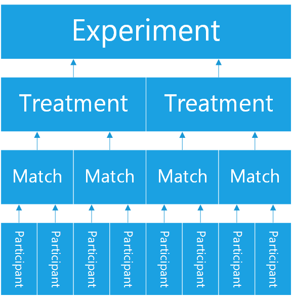

models.py
*******************

Introduction to models
++++++++++++++++++++++

The purpose of running an experiment is to record data --
what treatments are in your experiment,
what games were played in those treatments,
what the results were,
what actions the participants took, etc.

ptree stores your data in standard database tables (SQL).
For example, let's say you are programming an ultimatum game,
where in each 2-person match, one participant makes a monetary offer (say, 0-100 cents),
and another participant either rejects or accepts the offer.
You will want your "Match" table to look something like this:

    +----------+----------------+----------------+ 
    | Match ID | Amount offered | Offer accepted |
    +==========+================+================+
    | 1        | 50             | TRUE           |
    +----------+----------------+----------------+ 
    | 2        | 25             | FALSE          |
    +----------+----------------+----------------+ 
    | 3        | 50             | TRUE           |
    +----------+----------------+----------------+ 
    | 4        | 0              | FALSE          |
    +----------+----------------+----------------+ 
    | 5        | 60             | TRUE           |
    +----------+----------------+----------------+ 

In order to end up with this table schema, you need to define a Django model,
which is a Python class that defines a database table.
You define what fields (columns) are in the table,
what their data types are, and so on.
When you run your experiment, the SQL tables will get automatically generated,
and each time users visit, new rows will get added to the tables.

Here is what the model might look like for the above "Match" table::

    class Match(ptree.models.BaseModel):
        amount_offered = models.IntegerField()
        offer_accepted = models.BooleanField()
    
This class will be placed in your app's ``models.py`` file.

Every ptree app needs the following 4 models:

- Participant
- Match
- Treatment
- Experiment

They are related to each other as follows:

A ``Participant`` is part of a ``Match``, which is part of a ``Treatment``, which is part of an ``Experiment``.
This relationship is illustrated here:

How to define a model
+++++++++++++++++++++

ptree models are Django models.
To be able to define a model, 
you need to read the Django documentation on models and understand:

- Different types of model fields. The full list is `here <https://docs.djangoproject.com/en/dev/ref/models/fields/#model-field-types>`__. You don't have to know all field types. Just make sure you at least know ``IntegerField``, ``PositiveIntegerField``, ``CharField``, ``BooleanField``, ``NullBooleanField``, and ``FloatField``.
- Field options (explained `here <https://docs.djangoproject.com/en/dev/topics/db/models/#field-options>`__).
- Verbose field names (explained `here <https://docs.djangoproject.com/en/dev/topics/db/models/#verbose-field-names>`__).
- Model methods (explained `here <https://docs.djangoproject.com/en/dev/topics/db/models/#model-methods>`__).

ptree models reference
+++++++++++++++++++++++++++

In your models.py file, you will find pre-generated model classes
(Participant, Match, Treatment, and Experiment) that inherit from ptree's built-in 
models (BaseParticipant, BaseMatch, BaseTreatment, and BaseExperiment).

The base models already define many fields and methods that will come in handy for you;
they are documented below.

What you need to do in your models is:

- Fill out any methods that are required by the parent class
- Define any fields that you would like to be stored in the database (in addition to the ones listed below)
- Define any new methods you want on your models.

Participant
~~~~~~~~~~~

A ``Participant`` is a person who participates in a ``Match``.
For example, a Dictator Game match has 2 ``Participant`` objects.

A match can contain only 1 ``Participant`` if there is no interaction between ``Participant`` objects.
For example, a game that is simply a survey.

Implementation
______________

What is provided for you automatically
--------------------------------------

``Participant`` classes should inherit from ``ptree.models.participants.BaseParticipant``,
which gives you the following fields and methods:

match
=====

The ``Match`` this ``Participant`` is a part of.

index_among_participants_in_match: PositiveIntegerField
==========================================================

the ordinal position in which a participant joined a match. Starts at 0.

index_in_sequence_of_views: PositiveIntegerField
==================================================

Which page the user is on.

total_pay(): integer
=====================

How much the user makes (base pay + bonus).

What you must implement yourself
--------------------------------

bonus(): integer
====================

The bonus the participant gets paid, in addition to their base pay.

   
Match
~~~~~

A Match is a particular instance of a game being played,
and holds the results of that instance, i.e. what the score was, who got paid what.

So, "Match" is used in the sense of "chess match",
in the sense that it is an event that occurs where the game is played.

Example of a Match: "dictator game between participants Alice & Bob, where Alice gave $0.50"

Implementation
______________

What is provided for you automatically
--------------------------------------

``Match`` classes should inherit from ``ptree.models.participants.BaseMatch``,
which gives you the following fields and methods.

treatment
=========

The treatment this match is a part of.

experiment
===========

The experiment this match is a part of.

participants(self): iterable
=============================

Returns the participants in this match. 

time_started: DateTimeField
============================

When the match was started.

is_full(self): boolean
======================
    
Whether the match is full, i.e.::

	return len(self.participants()) >= self.treatment.participants_per_match

What you must implement yourself
--------------------------------

is_ready_for_next_participant(self): boolean
============================================

Whether the game is ready for another participant to be added.

If it's a non-sequential game (you do not have to wait for one participant to finish before the next one joins),
you can use this to assign participants until the game is full::

	return not self.is_full()

Treatment
~~~~~~~~~

A Treatment is the definition of what everyone in the treatment group has to do.

Example of a treatment:
'dictator game with stakes of $1, where participants have to chat with each other first'

A treatment is defined before the experiment starts.
Results of a game are not stored in Treatment object, they are stored in Match or Participant objects.

Implementation
______________

What is provided for you automatically
--------------------------------------

``Treatment`` classes should inherit from ``ptree.models.participants.BaseTreatment``,
which gives you the following fields and methods.

matches(self): iterable
========================
    
The ``Match`` objects in this ``Treatment``.

base_pay: PositiveIntegerField
==============================
    
How much each Participant is getting paid to play the game.
Needs to be set when you instantiate your ``Participant`` objects.

What you must implement yourself
--------------------------------

sequence_of_views(self): list
==============================
    
Very important. Returns a list of all the View classes that the participant gets routed through sequentially.
(Not all pages have to be displayed for all participants; see the ``show_skip_wait()`` method).
Must start with your app's ``StartTreatment``, and usually ends the Redemption Code view.
The rest is up to you.

Inside the method, you should import the modules containing the views you want to use.

Example::
	
	import donation.views as views
	import ptree.views.concrete
	return [views.StartTreatment,
			ptree.views.concrete.AssignParticipantAndMatch,
			views.IntroPage,
			views.EnterOffer, 
			views.Survey,
			ptree.views.concrete.RedemptionCode]
        
participants_per_match: PositiveIntegerField
==============================================

Number of participants in each match. 
For example, Prisoner's Dilemma has 2 participants.
a single-participant game would just have 1.

Experiment
~~~~~~~~~~
An experiment is generally a randomization between treatments, though it could just have one treatment.

Implementation
______________

Required arguments
__________________

What is provided for you automatically
--------------------------------------

is_for_mturk: BooleanField
==========================

Defaults to True. If true, the experiment URL will not work unless a participant's Mechanical Turk worker ID & assignment ID are appended to the URL.

treatments(self): iterable
==========================

Returns the treatments in this experiment. 

Methods that are optional to define
-----------------------------------

pick_treatment_for_incoming_participant(self): Treatment
=========================================================

This method will get called when a participant arrives at your site,
and needs to be randomized to a treatment.
Unless you override it,
this method returns a random choice between the treatments in the experiment,
weighted by their ``randomization_weight``::

    def pick_treatment_for_incoming_participant(self):
        choices = [(treatment, treatment.randomization_weight) for treatment in self.treatment_set.all()]
        treatment = self.weighted_randomization_choice(choices)
        return treatment

experimenter_sequence_of_views: list
=====================================

pTree provides an "experimenter link", 
which is a sequence of pages that lets the experimenter can participate interactively in the game.
The design of your experiment may require this.
For example, if you are running your experiment in a lab, 
and the experimenter needs to input the result of a of a random drawing into the database.
You can have a page where the experimenter enters the result into a form and submits.

You should implement this list in the same way as ``treatment.sequence_of_views()``.